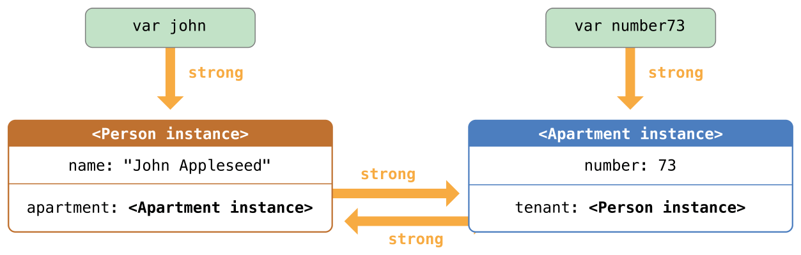

## 自动引用计数器


<h3 id="1.自动引用计数器">1.自动引用计数器</h3>

```swift
class Person {
    let name: String
    init(name: String) {
        self.name = name
        println("\(name) is being initialized")
    }
    deinit {
        println("\(name) is being deinitialized")
    }
}

var reference1:Person?

var reference2:Person?

var reference3:Person?

reference1 = Person(name: " John Appleseed")

// 打印 "John Appleseed is being initialized”

reference2 = reference1

reference3 = reference1

reference1 = nil

reference2 = nil

reference3 = nil
// 打印  John Appleseed is being deinitialized
```

<h3 id="2.类实例之间的循环强引用">2.类实例之间的循环强引用</h3>


```swift
class Person {
    let name: String
    var apartment: Apartment?
    init(name: String) {
        self.name = name
        println("\(name) is being initialized")
    }
    deinit {
        println("\(name) is being deinitialized")
    }
}

class Apartment {
    let number: Int
    init(number: Int) { self.number = number }
    var tenant: Person?
    deinit { println("Apartment #\(number) is being deinitialized") }
}
```

```swift
var john: Person?
var number73: Apartment?
john = Person(name: "John Appleseed")
number73 = Apartment(number: 73)
```
在两个实例被创建和赋值后，下图表现了强引用的关系。变量john现在有一个指向Person实例的强引用，而变量number73有一个指向Apartment实例的强引用：


```swift
john!.apartment = number73
number73!.tenant = john
```
在将两个实例联系在一起之后，强引用的关系如图所示：


将这两个实例关联在一起之后，一个循环强引用被创建了。Person实例现在有了一个指向Apartment实例的强引用，而Apartment实例也有了一个指向Person实例的强引用。因此，当你断开john和number73变量所持有的强引用时，引用计数并不会降为 0，实例也不会被 ARC 销毁：

```swift
john = nil
number73 = nil

```
在你将john和number73赋值为nil后，强引用关系如下图：


Person和Apartment实例之间的强引用关系保留了下来并且不会被断开。

<h3 id="3.解决实例之间的循环强引用">3.解决实例之间的循环强引用</h3>

Swift 提供了两种办法用来解决你在使用类的属性时所遇到的循环强引用问题：**弱引用（weak reference）和无主引用（unowned reference）**。

弱引用和无主引用允许循环引用中的一个实例引用另外一个实例而不保持强引用。这样实例能够互相引用而不产生循环强引用。

对于生命周期中会变为nil的实例使用弱引用。相反的，对于初始化赋值后再也不会被赋值为nil的实例，使用无主引用。

<h4 id="3.1弱引用">3.1弱引用</h4>


